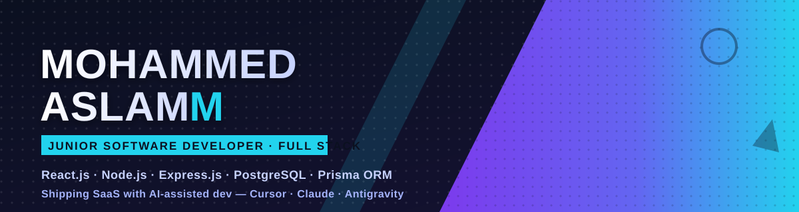
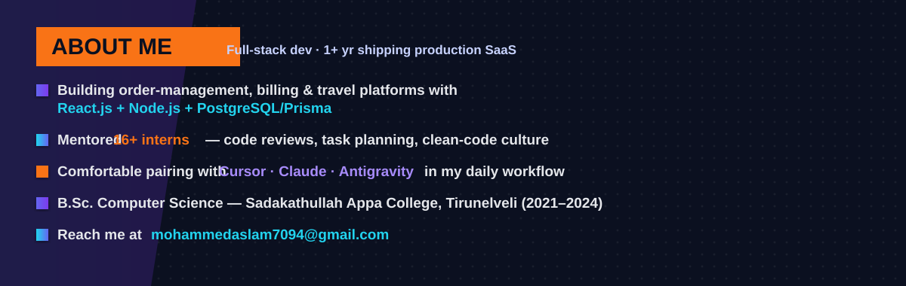
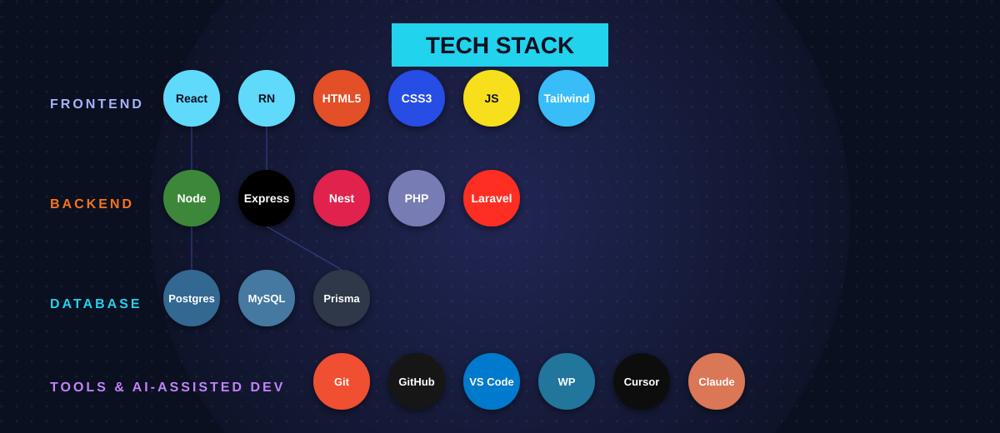

  

 

 

 

## 💼 Experience

<table>
<tr><td>

**Junior Software Developer** — Jaz Infotech &nbsp;`Mar 2025 – Present`
- Full-stack SaaS delivery across travel, order-management & billing systems
- Built & integrated 10+ REST APIs; optimized DB queries for performance
- Mentored 16+ interns through code reviews & task planning

</td></tr>
<tr><td>

**WordPress & SEO Intern** — Jaz Infotech &nbsp;`Sep 2024 – Feb 2025`
- Theme/plugin setup, on-page SEO, Analytics & Search Console optimization

</td></tr>
<tr><td>

**Web Development Intern** — Jaz Infotech &nbsp;`Sep 2024 – Feb 2025`
- Responsive pages with HTML/CSS/JS/Tailwind + PHP/MySQL functionality

</td></tr>
</table>

 

## 🚀 Featured Projects

| Project | Stack | Highlights |
|---|---|---|
| **Order Management & Billing System** | React · Tailwind · Node · Express · PostgreSQL · Prisma | Full billing platform with multi-template invoicing & party (customer/supplier) management |
| **Travlinks — Tours & Travels Platform** | React · Tailwind · Node · Express · PostgreSQL · Prisma | Trip costing engine + automated, trip-specific invoicing |
| **Club App — Tennis Court Management** | React · Tailwind · Laravel · MySQL | Membership management & session scheduling for club admins |
| **Join Me — Social Matching Mobile App** | React Native · Tailwind · Nest.js · PostgreSQL | Auth, registration & matching flows for shared-activity partners |
| **Muthuvel ERP** | React · Tailwind · Laravel · MySQL | ERP with invoicing + CRM modules for orders, purchases & customers |
| **Interior Design Viewer** *(personal client)* | HTML/CSS/JS · Tailwind · PHP · MySQL | Layout visualizer with materials manager, budget planner & auto-quotation |

 

## 📊 GitHub Stats

 

